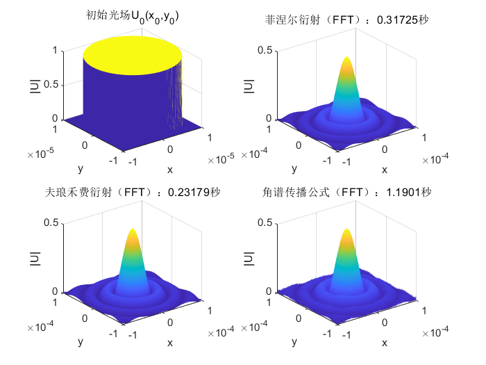
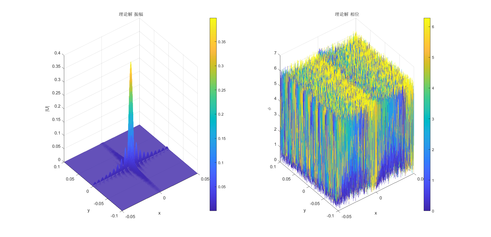
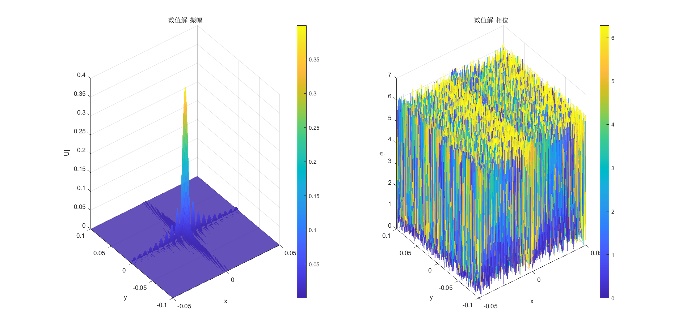
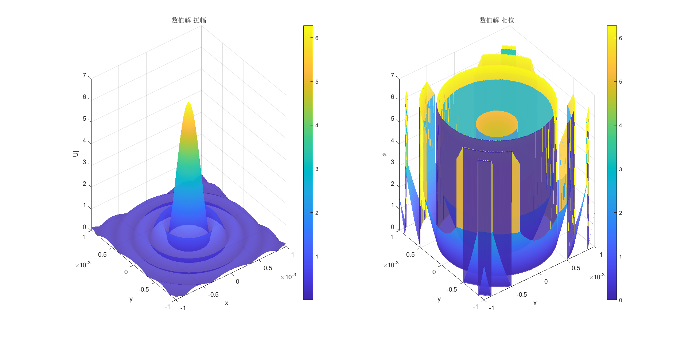

# 标量衍射理论 —— 相干光场在自由空间中传播衍射的数值计算（FFT）

[其他渠道查看此页](https://hexo.dytchem.cn/2025/03/22/Diffraction-Calculation/)

---

- 创新点

本项目实现了更一般情况下的快速离散傅里叶变换（DFT），

$$
Y_q=\sum_{p=0}^{n-1}{X_p\mathrm{e}^{-\mathrm{i}2\pi kpq}}\,\,\left( k\in \mathbb{R} \right)
$$

[跳转到DFT计算](#dft-section)

进而实现了更方便易用的连续傅里叶变换（FT）积分数值计算算法。

该算法不用限制原函数与像函数的网格尺寸，实现了针对任意区域任意精度的目标像函数计算。

（详见[myFFT1.m](myFFT1.m)和[myFFT2.m](myFFT2.m)）

---

## 四种衍射积分形式

- 基尔霍夫衍射初步近似（简单离散积分）

$$
U\left( x,y \right) =\frac{1}{\mathrm{j}\lambda z}\iint_{-\infty}^{+\infty}{U_0\left( x_0,y_0 \right) \mathrm{e}^{\mathrm{j}k\sqrt{z^2+\left( x-x_0 \right) ^2+\left( y-y_0 \right) ^2}}\mathrm{d}x_0\mathrm{d}y_0}
$$

- 菲涅尔衍射（简单离散积分 or 快速傅里叶变换快速卷积）

$$
U\left( x,y \right) =\frac{\mathrm{e}^{\mathrm{j}kz}}{\mathrm{j}\lambda z}\iint_{-\infty}^{+\infty}{U_0\left( x_0,y_0 \right) \mathrm{e}^{\mathrm{j}k\frac{\left( x-x_0 \right) ^2+\left( y-y_0 \right) ^2}{2z}}\mathrm{d}x_0\mathrm{d}y_0}
$$

- 夫琅禾费衍射（简单离散积分 or 快速傅里叶变换快速卷积）

$$
U\left( x,y \right) =\frac{\mathrm{e}^{\mathrm{j}kz}}{\mathrm{j}\lambda z}e^{\mathrm{j}\frac{k}{2z}\left( x^2+y^2 \right)}\iint_{-\infty}^{+\infty}{U_0\left( x_0,y_0 \right) \mathrm{e}^{-\mathrm{j}\frac{k}{z}\left( x_0x+y_0y \right)}\mathrm{d}x_0\mathrm{d}y_0}
$$

- 角谱传播公式（快速傅里叶变换快速卷积）

$$
\left\{ \begin{aligned}
 A_0\left( \xi ,\eta \right) &=\iint_{-\infty}^{+\infty}{U_0\left( x_0,y_0 \right) \mathrm{e}^{-\mathrm{j}2\pi \left( \xi x_0+\eta y_0 \right)}\mathrm{d}x_0\mathrm{d}y_0}\\
 A\left( \xi ,\eta \right) &=A_0\left( \xi _0,\eta _0 \right) e^{\mathrm{j}kz\sqrt{1-\left( \lambda \xi \right) ^2-\left( \lambda \eta \right) ^2}}\\
 U\left( x,y \right) &=\iint_{-\infty}^{+\infty}{A\left( \xi ,\eta \right) \mathrm{e}^{\mathrm{j}2\pi \left( \xi x+\eta y \right)}\mathrm{d}\xi \mathrm{d}\eta}\\
\end{aligned} \right.
$$

---

## 两种积分运算方式

- 简单离散积分

时间复杂度$O(N^2)$

- 快速傅里叶变换快速卷积

$$
\begin{cases}
 F\left( x \right)\\
 =\int_{-\infty}^{+\infty}{f\left( x_0 \right) \mathrm{e}^{-\mathrm{j}2\pi x_0x}\mathrm{d}x_0}\\
 =\frac{x_{\max}-x_{\min}}{m-1}\sum_{i=0}^{m-1}{f\left( \frac{x_{\max}-x_{\min}}{m-1}i+x_{\min} \right) \mathrm{e}^{-\mathrm{j}2\pi \left( \frac{x_{\max}-x_{\min}}{m-1}i+x_{\min} \right) \left( \frac{X_{\max}-X_{\min}}{M-1}I+X_{\min} \right)}}\\
 =A\sum_i^{m-1}{f\left( Ai+x_{\min} \right) \mathrm{e}^{-\mathrm{j}2\pi \left( BiI+Ci+DI+E \right)}}\\
 =A\left\{ \sum_i^{m-1}{\left[ f\left( Ai+x_{\min} \right) \mathrm{e}^{-\mathrm{j}2\pi Ci} \right] \mathrm{e}^{-\mathrm{j}2\pi BiI}} \right\} \mathrm{e}^{-\mathrm{j}2\pi \left( DI+E \right)}\\
 =...\\
\end{cases}
$$

最后，一般情况下的离散傅里叶变换（DFT）计算如下：

$$
\begin{cases}
 Y_q=\sum_{p=0}^{n-1}{X_p\mathrm{e}^{-\mathrm{i}2\pi kpq}}\,\,\left( k\in \mathbb{R} \right)\\
 =\sum_{p=0}^{n-1}{X_p\mathrm{e}^{\mathrm{i}\pi k\left[ \left( p-q \right) ^2-p^2-q^2 \right]}}\\
 =\left[ \sum_{p=0}^{n-1}{X_p\mathrm{e}^{-\mathrm{i}\pi kp^2}\mathrm{e}^{\mathrm{i}\pi k\left( p-q \right) ^2}} \right] \mathrm{e}^{-\mathrm{i}\pi kq^2}\\
 =\left( X_p\mathrm{e}^{-\mathrm{i}\pi kp^2}*\mathrm{e}^{\mathrm{i}\pi kp^2} \right) \mathrm{e}^{-\mathrm{i}\pi kq^2}\\
 =\mathscr{F} ^{-1}\left\{ \mathscr{F} \left\{ X_p\mathrm{e}^{-\mathrm{i}\pi kp^2}*\mathrm{e}^{\mathrm{i}\pi kp^2} \right\} \right\} \mathrm{e}^{-\mathrm{i}\pi kq^2}\\
 =\mathscr{F} ^{-1}\left\{ \mathscr{F} \left\{ X_p\mathrm{e}^{-\mathrm{i}\pi kp^2} \right\} \mathscr{F} \left\{ \mathrm{e}^{\mathrm{i}\pi kp^2} \right\} \right\} \mathrm{e}^{-\mathrm{i}\pi kq^2}\\
\end{cases}
$$

时间复杂度$Nlog(N)$，显著优于简单离散积分

代码请见 [myFFT1.m](myFFT1.m) 和 [myFFT2.m](myFFT2.m)

---

## 效率对比

- [32*32](task1_1.m)

- [128*128](task2_1.m)

- [1024*1024](task2_2.m) （简单离散积分无法跑出）

- [角谱传播 1024*1024](task2_3.m)

---

## 衍射样例

- [双缝干涉](task3_1.m)

- [振幅型余弦光栅](task4_1.m)

- [泊松亮斑](task5_1.m)

- [高斯拉盖尔光束](task6_1.m)

$ l = 5$

---

## 理论 - 数值 验证

- 矩形孔的衍射（[理论计算 vs 数值计算](test1.m)）

- 圆孔的衍射（[理论计算 vs 数值计算](test2.m)）

