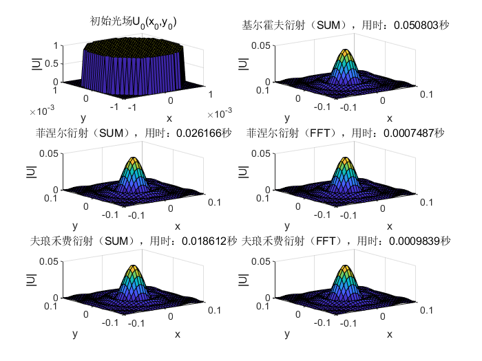
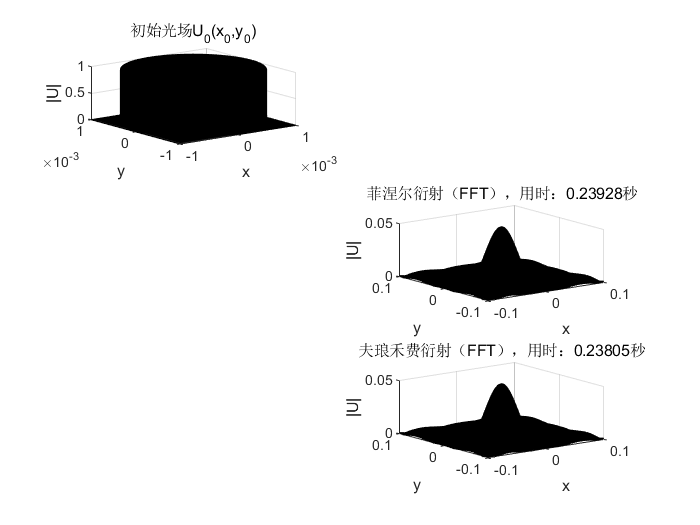
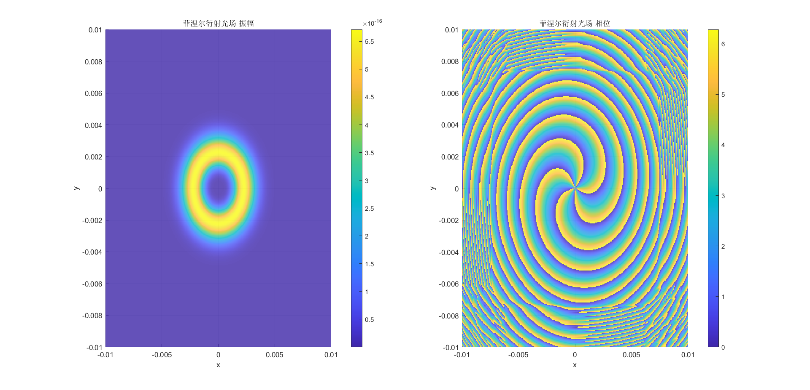

# 相干光场在自由空间中传播衍射的数值计算

---

## 三种衍射积分形式

- 基尔霍夫衍射初步近似（简单离散积分）

$$
U\left( x,y \right) =\frac{1}{\mathrm{j}\lambda z}\iint_{-\infty}^{+\infty}{U_0\left( x_0,y_0 \right) \mathrm{e}^{\mathrm{j}k\sqrt{z^2+\left( x-x_0 \right) ^2+\left( y-y_0 \right) ^2}}\mathrm{d}x_0\mathrm{d}y_0}
$$

- 菲涅尔衍射（简单离散积分 or 快速傅里叶变换快速卷积）

$$
U\left( x,y \right) =\frac{\mathrm{e}^{\mathrm{j}kz}}{\mathrm{j}\lambda z}\iint_{-\infty}^{+\infty}{U_0\left( x_0,y_0 \right) \mathrm{e}^{\mathrm{j}k\frac{\left( x-x_0 \right) ^2+\left( y-y_0 \right) ^2}{2z}}\mathrm{d}x_0\mathrm{d}y_0}
$$

- 夫琅禾费衍射（简单离散积分 or 快速傅里叶变换快速卷积）

$$
U\left( x,y \right) =\frac{\mathrm{e}^{\mathrm{j}kz}}{\mathrm{j}\lambda z}e^{\mathrm{j}\frac{k}{2z}\left( x^2+y^2 \right)}\iint_{-\infty}^{+\infty}{U_0\left( x_0,y_0 \right) \mathrm{e}^{-\mathrm{j}\frac{k}{z}\left( x_0x+y_0y \right)}\mathrm{d}x_0\mathrm{d}y_0}
$$

---

## 两种积分运算方式

- 简单离散积分

时间复杂度$O(N^2)$

- 快速傅里叶变换快速卷积

其中

时间复杂度$Nlog(N)$

代码请见 [myFFT1.m](myFFT1.m) 和 [myFFT2.m](myFFT2.m)

---

## 效率对比

- [32*32](task1.m)

- [128*128](task2_1.m)

- [1024*1024](task2_2.m)

---

## 衍射样例

- [双缝干涉](task3_1.m)

]

- [振幅型余弦光栅](task4.m)

- [泊松亮斑](task5.m)

- [高斯拉盖尔光束](task6.m)

