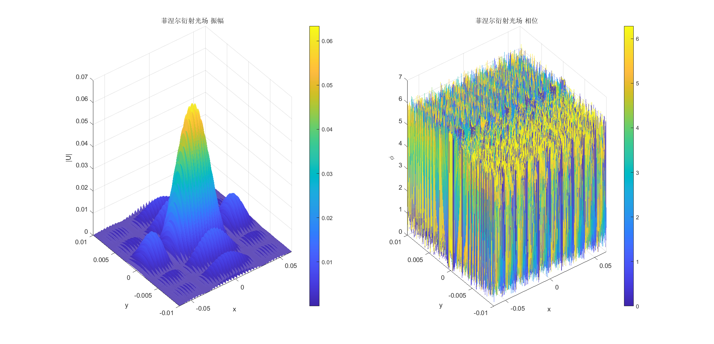
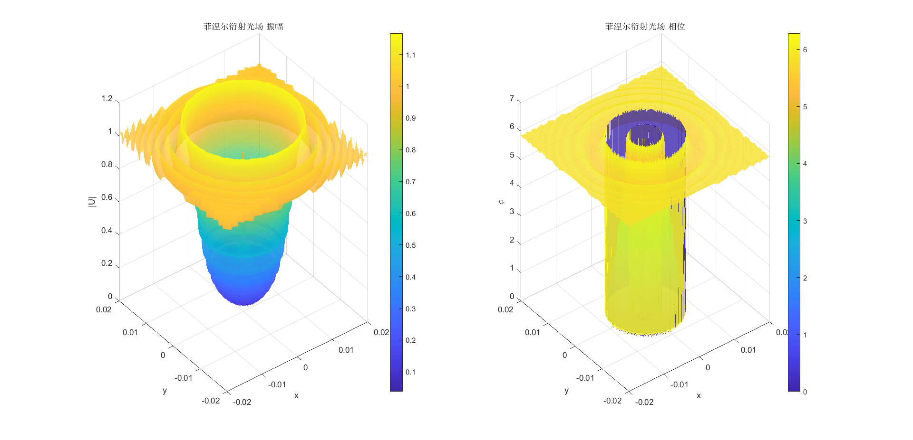

# 相干光场在自由空间中传播衍射的数值计算

---

## 三种衍射积分形式

- 基尔霍夫衍射初步近似（简单离散积分）

$$
U\left( x,y \right) =\frac{1}{\mathrm{j}\lambda z}\iint_{-\infty}^{+\infty}{U_0\left( x_0,y_0 \right) \mathrm{e}^{\mathrm{j}k\sqrt{z^2+\left( x-x_0 \right) ^2+\left( y-y_0 \right) ^2}}\mathrm{d}x_0\mathrm{d}y_0}
$$

- 菲涅尔衍射（简单离散积分 or 快速傅里叶变换快速卷积）

$$
U\left( x,y \right) =\frac{\mathrm{e}^{\mathrm{j}kz}}{\mathrm{j}\lambda z}\iint_{-\infty}^{+\infty}{U_0\left( x_0,y_0 \right) \mathrm{e}^{\mathrm{j}k\frac{\left( x-x_0 \right) ^2+\left( y-y_0 \right) ^2}{2z}}\mathrm{d}x_0\mathrm{d}y_0}
$$

- 夫琅禾费衍射（简单离散积分 or 快速傅里叶变换快速卷积）

$$
U\left( x,y \right) =\frac{\mathrm{e}^{\mathrm{j}kz}}{\mathrm{j}\lambda z}e^{\mathrm{j}\frac{k}{2z}\left( x^2+y^2 \right)}\iint_{-\infty}^{+\infty}{U_0\left( x_0,y_0 \right) \mathrm{e}^{-\mathrm{j}\frac{k}{z}\left( x_0x+y_0y \right)}\mathrm{d}x_0\mathrm{d}y_0}
$$

---

## 两种积分运算方式

- 简单离散积分

时间复杂度$O(N^2)$

- 快速傅里叶变换快速卷积

$$
F\left( x \right) =\int_{-\infty}^{+\infty}{f\left( x_0 \right) \mathrm{e}^{-\mathrm{j}2\pi x_0x}\mathrm{d}x_0}
\\
=\frac{x_{\max}-x_{\min}}{m-1}\sum_{i=0}^{m-1}{f\left( \frac{x_{\max}-x_{\min}}{m-1}i+x_{\min} \right) \mathrm{e}^{-\mathrm{j}2\pi \left( \frac{x_{\max}-x_{\min}}{m-1}i+x_{\min} \right) \left( \frac{X_{\max}-X_{\min}}{M-1}I+X_{\min} \right)}}
\\
=A\sum_i^{m-1}{f\left( Ai+x_{\min} \right) \mathrm{e}^{-\mathrm{j}2\pi \left( BiI+Ci+DI+E \right)}}
\\
=A\left\{ \sum_i^{m-1}{\left[ f\left( Ai+x_{\min} \right) \mathrm{e}^{-\mathrm{j}2\pi Ci} \right] \mathrm{e}^{-\mathrm{j}2\pi BiI}} \right\} \mathrm{e}^{-\mathrm{j}2\pi \left( DI+E \right)}
\\
=...
$$

其中

$$
Y_q=\sum_{p=0}^{n-1}{X_p\mathrm{e}^{-\mathrm{i}2\pi kpq}}\,\,\left( k\in \mathbb{R} \right)
\\
=\sum_{p=0}^{n-1}{X_p\mathrm{e}^{\mathrm{i}\pi k\left[ \left( p-q \right) ^2-p^2-q^2 \right]}}
\\
=\left[ \sum_{p=0}^{n-1}{X_p\mathrm{e}^{-\mathrm{i}\pi kp^2}\mathrm{e}^{\mathrm{i}\pi k\left( p-q \right) ^2}} \right] \mathrm{e}^{-\mathrm{i}\pi kq^2}
\\
=\left( X_p\mathrm{e}^{-\mathrm{i}\pi kp^2}*\mathrm{e}^{\mathrm{i}\pi kp^2} \right) \mathrm{e}^{-\mathrm{i}\pi kq^2}
\\
=\mathscr{F} ^{-1}\left\{ \mathscr{F} \left\{ X_p\mathrm{e}^{-\mathrm{i}\pi kp^2}*\mathrm{e}^{\mathrm{i}\pi kp^2} \right\} \right\} \mathrm{e}^{-\mathrm{i}\pi kq^2}
\\
=\mathscr{F} ^{-1}\left\{ \mathscr{F} \left\{ X_p\mathrm{e}^{-\mathrm{i}\pi kp^2} \right\} \mathscr{F} \left\{ \mathrm{e}^{\mathrm{i}\pi kp^2} \right\} \right\} \mathrm{e}^{-\mathrm{i}\pi kq^2}
$$

时间复杂度$Nlog(N)$

代码请见 [myFFT.m](myFFT.m) 和 [myFFT2.m](myFFT2.m)

---

## 效率对比

- [32*32](task1.m)

- [128*128](task2.m)

---

## 衍射样例

- [双缝干涉](task3_1.m)

- [振幅型余弦光栅](task4.m)

- [泊松亮斑](task5.m)

- [旋转周期型波片](task6.m)

